# Radio Calico - System Architecture

This document provides a comprehensive overview of the Radio Calico system architecture.

## Table of Contents

- [High-Level Architecture](#high-level-architecture)
- [Application Architecture](#application-architecture)
- [Database Schema](#database-schema)
- [Frontend Architecture](#frontend-architecture)
- [Docker Architecture](#docker-architecture)
- [CI/CD Pipeline](#cicd-pipeline)
- [Data Flow](#data-flow)
- [Deployment Architecture](#deployment-architecture)

---

## High-Level Architecture

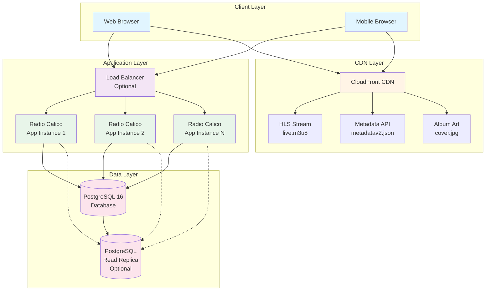

---

## Application Architecture

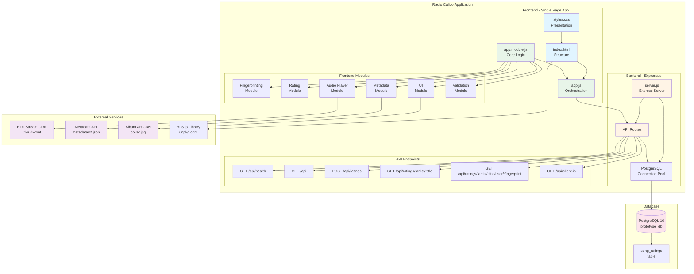

---

## Database Schema

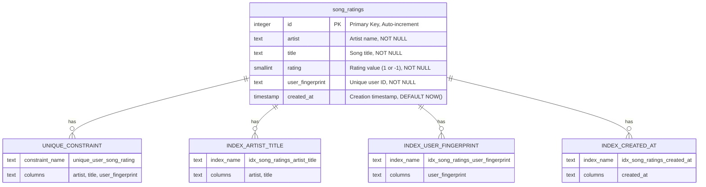

**Database Details:**
- **Primary Key:** Auto-incrementing `id`
- **Unique Constraint:** Prevents duplicate ratings (same user, same song)
- **Indexes:** Optimized for queries by artist/title, user fingerprint, and creation time
- **Rating Values:** `1` (thumbs up) or `-1` (thumbs down)
- **Upsert Support:** Allows users to change their rating

---

## Frontend Architecture

```mermaid
graph LR
    subgraph "Browser Environment"
        subgraph "User Interface"
            Player[Audio Player<br/>Controls]
            NowPlaying[Now Playing<br/>Display]
            RecentTracks[Recently Played<br/>List]
            RatingButtons[Rating Buttons<br/>Thumbs Up/Down]
            Volume[Volume Control]
            ElapsedTime[Elapsed Time<br/>Display]
        end

        subgraph "Application State"
            CurrentTrack[currentTrack<br/>{artist, title}]
            UserFP[userFingerprint]
            HLSInstance[HLS.js Instance]
            Timers[Timers & Intervals]
            AudioElement[Audio Element]
        end

        subgraph "Core Modules - app.module.js"
            FPModule[Fingerprinting<br/>- Canvas FP<br/>- WebGL FP<br/>- Audio FP<br/>- Browser Features<br/>- IP Address]

            MetadataModule[Metadata<br/>- Fetch metadata<br/>- Update display<br/>- Track history<br/>- Album art]

            RatingModule[Rating<br/>- Submit rating<br/>- Get counts<br/>- User rating<br/>- Update UI]

            UIModule[UI Controls<br/>- Play/Pause<br/>- Volume<br/>- Display updates<br/>- Error handling]

            AudioModule[Audio Player<br/>- HLS.js setup<br/>- Stream loading<br/>- Error recovery<br/>- Safari fallback]

            ValidationModule[Validation<br/>- Input validation<br/>- Data sanitization]
        end

        subgraph "Orchestration - app.js"
            Init[Initialization<br/>- Get fingerprint<br/>- Setup HLS<br/>- Setup UI<br/>- Start polling]

            Polling[Metadata Polling<br/>Every 2 seconds]

            EventHandlers[Event Handlers<br/>- Play/Pause<br/>- Volume change<br/>- Rating clicks]

            StateManagement[State Management<br/>- Track changes<br/>- Timer updates<br/>- Rating sync]
        end

        Player --> AudioElement
        NowPlaying --> CurrentTrack
        RatingButtons --> RatingModule

        Init --> FPModule
        Init --> AudioModule
        Init --> UIModule
        Init --> Polling

        Polling --> MetadataModule
        EventHandlers --> RatingModule
        EventHandlers --> UIModule

        AudioModule --> HLSInstance
        HLSInstance --> AudioElement

        MetadataModule --> StateManagement
        RatingModule --> StateManagement
        StateManagement --> CurrentTrack
    end

    subgraph "External APIs"
        StreamAPI[HLS Stream API]
        MetaAPI[Metadata API<br/>2-second polling]
        ArtAPI[Album Art API]
        BackendAPI[Backend API<br/>Rating endpoints]
    end

    AudioModule --> StreamAPI
    MetadataModule --> MetaAPI
    MetadataModule --> ArtAPI
    RatingModule --> BackendAPI

    style Player fill:#e1f5ff
    style NowPlaying fill:#e1f5ff
    style FPModule fill:#e8f5e9
    style MetadataModule fill:#e8f5e9
    style RatingModule fill:#e8f5e9
    style UIModule fill:#e8f5e9
    style AudioModule fill:#e8f5e9
    style Init fill:#fff4e6
    style Polling fill:#fff4e6
```

---

## Docker Architecture

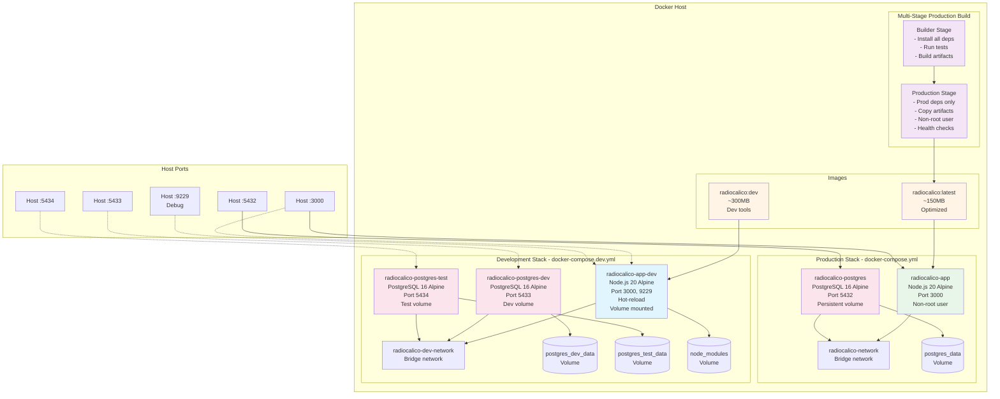

---

## CI/CD Pipeline

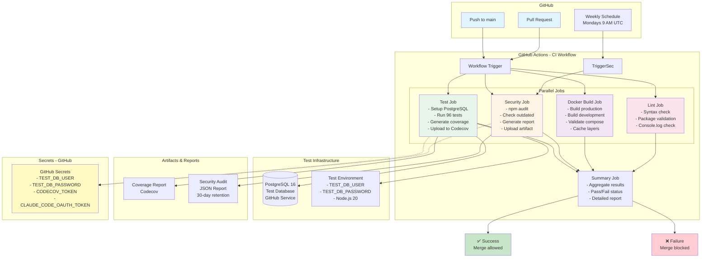

---

## Data Flow

### Rating Submission Flow

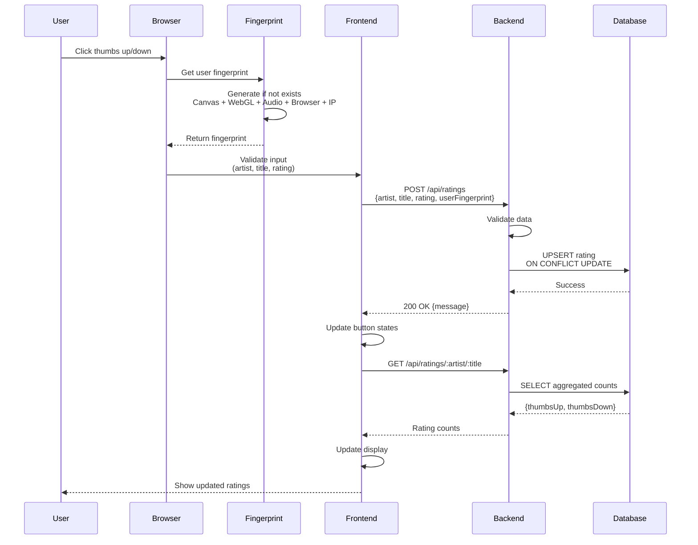

### Metadata Polling Flow

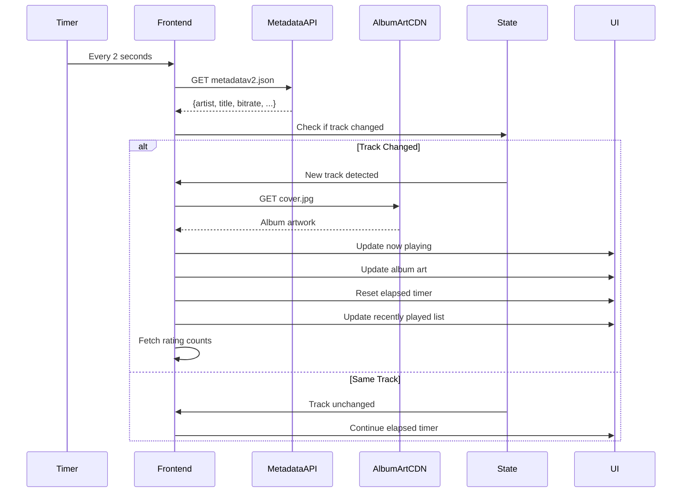

### Audio Streaming Flow

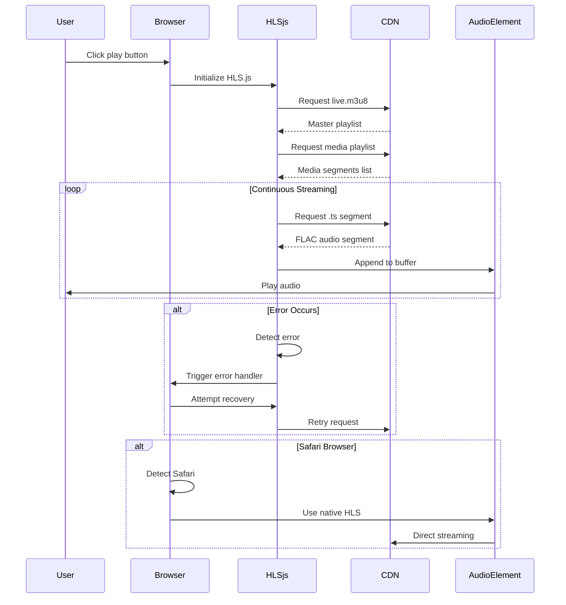

---

## Deployment Architecture

### Production Deployment

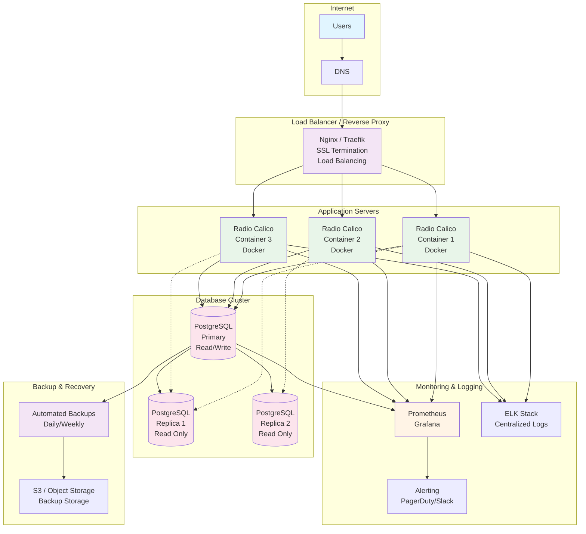

### Development/Local Deployment

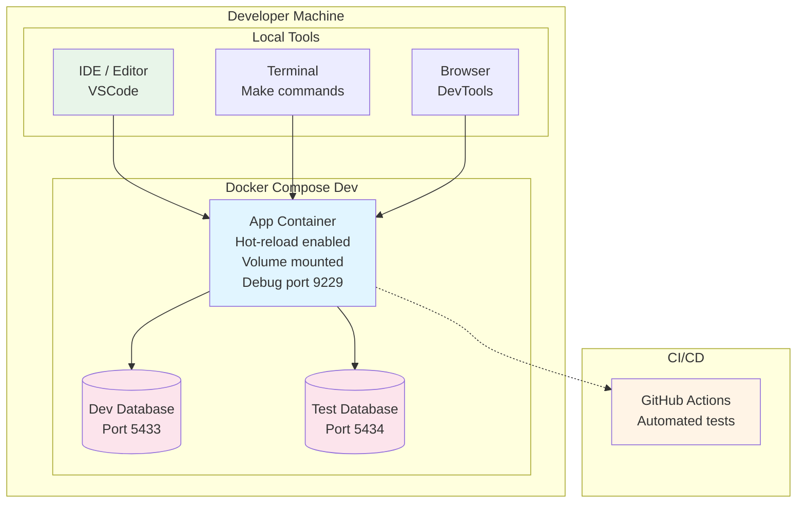

---

## Technology Stack

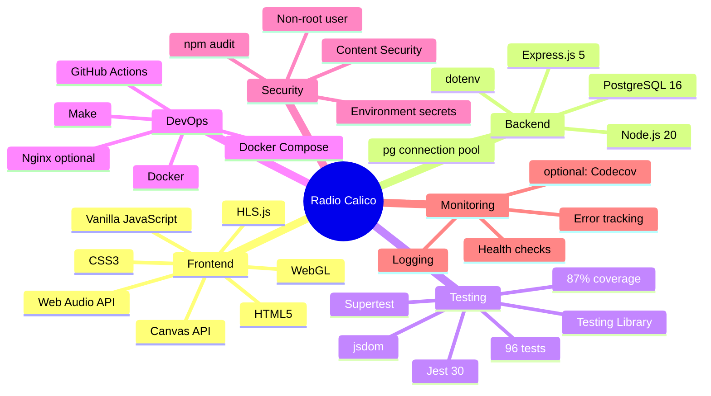

---

## Scaling Considerations

### Horizontal Scaling

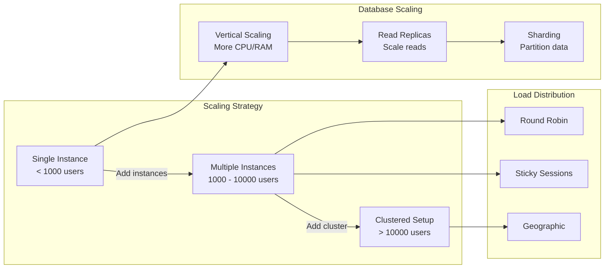

---

## Security Architecture

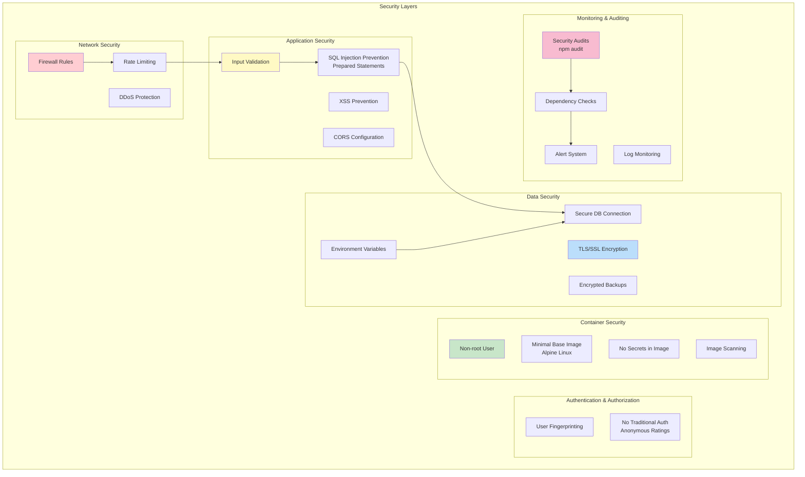

---

## Summary

Radio Calico is a modern, containerized web application built with:

- **Frontend:** Vanilla JavaScript with modular architecture
- **Backend:** Node.js/Express with PostgreSQL
- **Deployment:** Docker with production and development configurations
- **CI/CD:** GitHub Actions with automated testing and security scanning
- **Monitoring:** Health checks, logging, and optional coverage tracking
- **Security:** Multi-layered security approach with regular audits

The architecture is designed for:
- ✅ Scalability - Horizontal scaling with load balancing
- ✅ Reliability - Health checks and error recovery
- ✅ Security - Multiple security layers and regular audits
- ✅ Maintainability - Clean separation of concerns
- ✅ Testability - 96 tests with 87% coverage
- ✅ Deployability - Docker containers with CI/CD automation
